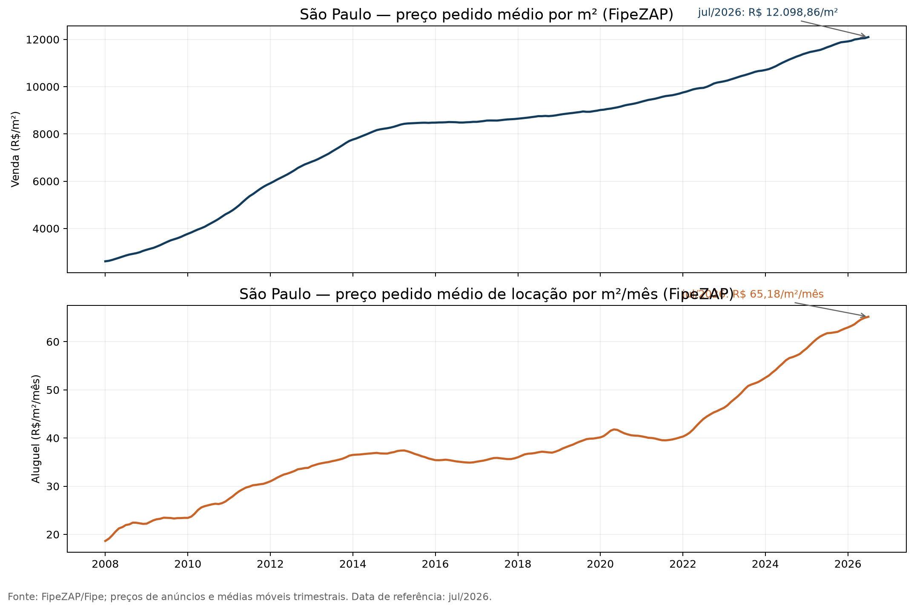
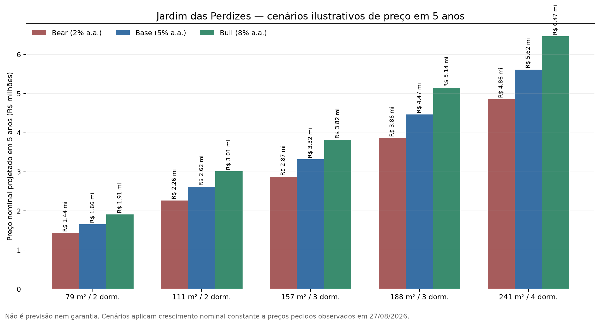

# Estudo 360º do mercado imobiliário do Jardim das Perdizes

## Mercado, concorrência, produtos, preços, valorização e potencial — 27 de agosto de 2026

**Cliente:** Jardim das Perdizes Broker  
**Autor:** Manus AI  
**Data de referência:** 27/08/2026, GMT-3  
**Escopo:** Jardim das Perdizes, Água Branca, Barra Funda, Perdizes, Pompeia e benchmarks selecionados da Zona Oeste de São Paulo.

> **Aviso de análise:** sou uma IA, não um consultor financeiro licenciado nem avaliador imobiliário. Este documento é pesquisa de mercado, não aconselhamento financeiro personalizado nem promessa de valorização. Investimentos imobiliários envolvem risco, iliquidez, custos, crédito, tributação e possibilidade de perda; qualquer decisão concreta deve ser validada com corretor habilitado, avaliador, advogado e contador quando aplicável.

---

## 1. Síntese executiva

O Jardim das Perdizes é um submercado residencial planejado, de padrão médio-alto e alto, inserido em uma zona de transformação urbana que combina parque, condomínios recentes, novos produtos, mobilidade ferroviária/metropolitana e proximidade de polos de consumo, educação, saúde, entretenimento e emprego. A tese comercial é forte, mas a tese de valorização precisa ser tratada com disciplina: os dados públicos disponíveis comprovam qualidade urbana, escala do projeto, oferta de produtos e catalisadores; não comprovam, por si só, retorno futuro acima da inflação.

A conclusão mais importante do estudo é que **o comportamento do preço do núcleo não deve ser representado pela média da cidade de São Paulo**. A cidade serve como benchmark, mas as unidades do Jardim das Perdizes carregam prêmio de localização, planejamento, idade, lazer, vista, segurança, parque, marca, condomínio e escassez relativa. Esse prêmio também cria risco: o comprador pode pagar caro por atributos que não se traduzem integralmente em preço de revenda ou renda líquida.

O FipeZAP, cuja base é composta por preços de anúncios nos portais do Grupo OLX e trabalha com apartamentos prontos, registrou em São Paulo, em julho de 2026, preço pedido médio de **R$ 12.098,86/m² para venda** e **R$ 65,18/m²/mês para locação**. Na comparação de 12 meses, a venda subiu **3,70% nominalmente**, abaixo do IPCA de **4,44%** no mesmo intervalo, resultando em aproximadamente **-0,71% real**. A locação subiu **5,53% nominalmente** e **1,04% real**. Em cinco anos, a venda acumulou **26,44% nominalmente**, mas **-3,82% em termos reais**, enquanto a locação acumulou **64,84% nominalmente** e **25,40% reais**. Esses números são de São Paulo, não do Jardim das Perdizes, e os preços são de anúncios, não de negócios fechados. [1] [2] [3]

A amostra própria de 21 anúncios de venda coletados em 27/08/2026 em Century21, França Prime, FMI Prime e Viva Real encontrou mediana de **R$ 17.415,19/m² até 100 m²**, **R$ 18.468,47/m² entre 101 e 180 m²** e **R$ 18.811,88/m² acima de 180 m²**. A amostra de aluguel, com nove anúncios em Viva Real e QuintoAndar, apresentou mediana de aproximadamente **R$ 86,98/m²/mês até 70 m²** e **R$ 83,43/m²/mês entre 71 e 110 m²**, com forte dispersão e prêmio aparente para mobiliados. Estes dados são preços pedidos, têm duplicidades e misturam núcleo com entorno em alguns portais; servem para inteligência comercial, não para laudo de avaliação.

| Dimensão | Leitura estratégica |
|---|---|
| Mercado de venda | Mercado com prêmio relevante sobre a média municipal, sustentado por produto, parque, planejamento e condomínios recentes; exige controle rigoroso de unidade, torre, vista, vaga e estado. |
| Mercado de locação | Mais dinâmico que a venda na série municipal recente; bom espaço para produto de locação padrão, mobiliada e corporativa, mas condomínio/IPTU podem destruir yield líquido. |
| Concorrência | Portais dominam escala; incorporadora domina narrativa oficial; imobiliárias locais dominam inventário e atendimento. A Broker deve competir por dados, contexto, comparação, curadoria e prova hiperlocal. |
| Catalisadores | Parque, operação urbana Água Branca, Linha 6-Laranja, novos serviços e maturação do bairro. Todos têm estágio, prazo e risco diferentes. |
| Riscos | Juros ainda elevados, preço/m² premium, estoque concorrente, taxonomia geográfica imprecisa, custo condominial, liquidez de alto padrão e risco de execução de obras públicas. |
| Potencial de valorização | Base estrutural positiva, mas sem evidência suficiente para prometer valorização. O cenário-base prudente é crescimento nominal moderado, dependente de renda, juros, locação e microqualidade. |

### Diagnóstico em uma frase

**O Jardim das Perdizes é um produto urbano diferenciado e comercialmente defensável, mas não deve ser vendido com a promessa simplista de que “sempre valoriza”; a vantagem da Broker será provar, unidade por unidade, preço, custo, renda, liquidez, risco e contexto.**

---

## 2. Escopo, metodologia e limites da pesquisa

O estudo foi organizado em três anéis. O primeiro é o núcleo do Jardim das Perdizes e seus condomínios. O segundo é o entorno imediato, incluindo Água Branca, Barra Funda, Perdizes e Pompeia. O terceiro é um benchmark ampliado, utilizado apenas quando há dados comparáveis, abrangendo Vila Romana, Lapa, Pacaembu, Sumaré, Pinheiros e outros submercados da Zona Oeste.

A separação é necessária porque os portais frequentemente indexam o Jardim das Perdizes por Água Branca, Barra Funda, Perdizes ou ruas limítrofes. O endereço do imóvel, o condomínio e a torre devem prevalecer sobre a taxonomia do portal. O estudo separa venda, aluguel, mobiliado, pronto, em obras, revenda, unidades especiais e produtos comerciais sempre que a fonte permite.

| Regra | Aplicação |
|---|---|
| Preço pedido não é preço transacionado | Anúncios medem preço de aspiração e oferta; descontos e negócios fechados não foram observados em base pública confiável. |
| Mediana antes da média | Coberturas, gardens e unidades de 283–294 m² distorcem médias; mediana e quartis são mais úteis. |
| Área útil/privativa não pode ser misturada com área total | A base priorizou a área informada no anúncio, mas exige validação documental antes de comparar unidades. |
| Nominal versus real | Variação nominal foi deflacionada pelo IPCA mensal da série SGS 433 do Banco Central. |
| Microbairro versus cidade | FipeZAP São Paulo é benchmark, não proxy perfeito do Jardim das Perdizes. |
| Oferta de portal não é estoque | Duplicidades, cards patrocinados, anúncios inativos e localização ampliada podem inflar contagens. |
| Potencial não é previsão | Cenários Bear/Base/Bull são sensibilidades de decisão, não recomendação ou garantia. |

### Nível de confiança das principais informações

| Informação | Fonte principal | Confiança | Limitação |
|---|---|---|---|
| Metodologia e série São Paulo | Fipe/FipeZAP | Alta para definição do índice; média para microdecisão | Anúncios e médias móveis; não é transação. |
| IPCA mensal | Banco Central/IBGE | Alta | Deflator macro, não índice de custo específico do proprietário. |
| Vendas de imóveis novos na capital | Secovi-SP | Alta para o universo pesquisado | Incorporadoras associadas e cidade inteira; não é revenda do núcleo. |
| Condôminos, áreas e estágios de produtos | Tecnisa, Hines, Lopes | Alta para informação institucional publicada | Estoque e preço mudam; algumas páginas misturam escopos. |
| Preços pedidos | Portais e imobiliárias | Média para fotografia de oferta | Duplicidade, atualização e taxonomia. |
| Preços fechados e liquidez | Não disponíveis publicamente em granularidade suficiente | Baixa/ausente | A Broker precisa construir base própria de transações e funil. |
| Potencial de valorização | Inferência estruturada | Baixa a média | Depende de juros, renda, oferta, execução e unidade. |

---

## 3. O mercado paulistano e o ciclo de 2026

### 3.1 Preço de venda e aluguel em São Paulo

O FipeZAP acompanha preços de anúncios de venda e locação publicados nos portais ZAP, Viva Real e OLX. No residencial, o índice acompanha apartamentos prontos em até 56 cidades, incluindo capitais. A planilha histórica oficial disponibiliza séries de índice, preço médio por m², variações mensais e em 12 meses, segmentadas por cidade e número de dormitórios. [1] [2]

| Janela terminada em jul/2026 | Venda SP | IPCA do período | Venda real aproximada | Aluguel SP | Aluguel real aproximado |
|---|---:|---:|---:|---:|---:|
| 12 meses | +3,70% | +4,44% | -0,71% | +5,53% | +1,04% |
| 3 anos | +15,39% | +14,84% | +0,47% | +30,05% | +13,24% |
| 5 anos | +26,44% | +31,45% | -3,82% | +64,84% | +25,40% |
| 10 anos | +42,41% | +62,38% | -12,30% | +85,37% | +14,16% |
| out/2011–jul/2026 | +113,49% | +127,28% | -6,07% | +114,39% | -5,67% |

O contraste entre venda e locação é decisivo para a estratégia. A venda tem menor liquidez e maior sensibilidade ao crédito, enquanto a locação pode reagir mais rapidamente a renda, emprego, mobilidade, procura por apartamentos compactos e escassez de imóveis adequados. Isso não significa que o aluguel seja automaticamente melhor investimento: condomínio, IPTU, vacância, manutenção, administração, impostos, mobília e custo de aquisição reduzem a renda líquida.

A leitura correta do gráfico é de **preços pedidos médios em São Paulo**, calculados com média móvel trimestral. Ele não prova que uma unidade do Jardim das Perdizes valorizou na mesma proporção. A principal utilidade é indicar regime de mercado: a venda paulistana teve alta nominal mais contida, enquanto o aluguel acelerou de forma mais clara a partir de 2022.

### 3.2 Mercado de imóveis novos

A Pesquisa Secovi-SP do Mercado Imobiliário, realizada junto a incorporadoras associadas, informou comercialização de **9.308 unidades residenciais novas em junho de 2026** e **114,0 mil unidades no período de julho de 2025 a junho de 2026** na cidade de São Paulo. [4]

Esse volume revela um mercado novo ativo, mas não deve ser confundido com o mercado de revenda do Jardim das Perdizes. O impacto para a Broker é duplo: novos lançamentos ampliam a concorrência por compradores e locatários, mas também ajudam a consolidar a região, formar comparáveis e criar demanda por revenda e locação quando as unidades são entregues.

### 3.3 Juros, crédito e affordability

O Copom reduziu a taxa Selic para **14,00% ao ano**, a partir de 06/08/2026. [22] Mesmo com a trajetória de cortes, o patamar continua relevante para custo de oportunidade, crédito imobiliário, renda fixa, decisão de financiar e disponibilidade de capital para compradores de alto padrão.

A sensibilidade é maior nos tickets entre R$ 1 milhão e R$ 3 milhões, nos quais muitos compradores ainda dependem de financiamento, e nos produtos de investimento, cujo custo de oportunidade compete diretamente com renda fixa. Para unidades de R$ 4 milhões a R$ 6 milhões, o crédito pode ter peso menor, mas o custo de oportunidade e a liquidez continuam relevantes.

A Broker deve acompanhar mensalmente Selic, curva de juros, crédito imobiliário, renda, emprego, inflação e preço de aluguel. A comunicação comercial precisa evitar frases como “agora é a hora porque os juros vão cair”; o correto é apresentar o impacto do financiamento na unidade específica e deixar premissas explícitas.

---

## 4. O Jardim das Perdizes como produto urbano

### 4.1 Escala, planejamento e identidade

A Tecnisa apresenta o Jardim das Perdizes como bairro planejado e associa o projeto a parque central de mais de 45 mil m², áreas verdes, certificação AQUA, segurança e programação de experiências. Também apresenta produtos residenciais por tipologia e estágio, como unidades em obras, prontas e vendidas. [9]

A Hines descreve o projeto como uma propriedade residencial de uso misto de grande escala na Barra Funda. A página informa a conclusão, em 2016, dos quatro primeiros condomínios — Reserva Manacá, Bosque Jequitibá, Bosque Araucária e Recanto Jacarandá — totalizando dez torres e 1.841 unidades, além da conclusão do Jardim das Perdizes TIME em 2017. A mesma página apresenta números de escopo diferentes entre detalhes de construção e visão ampliada do projeto; por isso, não se deve publicar um total único sem data e definição de perímetro. [10]

A vantagem estrutural do produto é a combinação de bairro planejado, parque, condomínios recentes, lazer, segurança, serviços e diversidade de plantas. A desvantagem é que o prêmio de preço precisa ser defendido em cada unidade por vista, posição, andar, vaga, reforma, orientação solar, condomínio, estado de conservação, torre e liquidez.

### 4.2 Parque e qualidade urbana

A Prefeitura de São Paulo informa que o Parque Jardim das Perdizes foi implantado em área doada ao município em função do empreendimento. A fonte municipal registra piso drenante, equipamentos para pets, obras de Tomie Ohtake, ciclovia, playground, aparelhos de ginástica, pisos podotáteis, rampas, iluminação LED e soluções de drenagem. Também registra 43 espécies vasculares no inventário de flora de 2021. [11]

Esses atributos são relevantes para demanda de famílias, pets, moradores que valorizam caminhada e compradores que buscam uma experiência de bairro. Não se deve converter automaticamente o parque em prêmio fixo de R$ por m²; a distância da torre, a vista efetiva e o acesso real são determinantes.

### 4.3 Mobilidade

A LinhaUni informa que a Linha 6-Laranja possui 15,3 km, com projeção de reduzir determinado trajeto de cerca de 1h30 de ônibus para 23 minutos e demanda estimada de aproximadamente 633 mil passageiros por dia. A página da Estação Perdizes, atualizada em 12/08/2026, informa profundidade de 29,05 m, acesso pela Rua Apiacás e Rua Ciro Costa e status “Finalizado”. [7] [8]

A leitura comercial deve ser precisa. A estação ter status “Finalizado” na ficha da concessionária não equivale a dizer que toda a linha esteja em operação comercial plena, com frequência e horários definitivos. Em agosto de 2026, a comunicação pública indicava transição/operação assistida em parte do sistema. O conteúdo da Broker deve publicar a data da checagem, a fonte e o status específico da estação/trecho.

A mobilidade pode elevar acessibilidade, ampliar o raio de busca de compradores e reduzir fricção para usuários que trabalham em outros polos. Também pode aumentar fluxo, ruído e pressão sobre ruas específicas. O efeito líquido depende de acesso, distância a pé, integração, horário e qualidade da operação.

---

## 5. Catalisadores urbanos e riscos de execução

### 5.1 Operação Urbana Água Branca

A Operação Urbana Consorciada Água Branca começou em 1995, foi aperfeiçoada pela Lei nº 15.893/2013 e está inserida na Macroárea de Estruturação Metropolitana, no Arco Tietê, setor da Orla Ferroviária e Fluvial. O plano urbanístico contempla circulação e mobilidade, áreas verdes, equipamentos, adensamento populacional, habitação de interesse social, infraestrutura viária, drenagem, saúde, educação e cultura. [5]

Em 2026, a Prefeitura abriu inscrições para a eleição do Grupo de Gestão da operação para o biênio 2026–2028. O colegiado é paritário entre sociedade civil e poder público e acompanha intervenções prioritárias e aplicação de recursos de outorga onerosa e CEPACs. [6]

A OUCAB é um catalisador de longo prazo, não um cheque em branco. Oportunidades incluem melhoria de infraestrutura, urbanização, conexão, serviços e requalificação. Riscos incluem mudança de prioridade, demora, governança, financiamento, licenciamento, execução incompleta, externalidades de obras e maior oferta concorrente.

### 5.2 Matriz de catalisadores

| Catalisador | Horizonte | Mecanismo potencial | Evidência atual | Risco de execução | Como a Broker deve comunicar |
|---|---|---|---|---|---|
| Parque Jardim das Perdizes | Já existente | Diferenciação de experiência, lazer e demanda familiar | Fonte municipal e observação local | Manutenção, acesso e percepção | Fato verificável, fotos próprias, sem quantificar prêmio automaticamente. |
| Estação Perdizes/Linha 6 | Curto/médio | Acessibilidade e redução de tempo de deslocamento | LinhaUni; estação com status finalizado | Operação assistida, frequência e integração | Informar status e data; não prometer valorização. |
| OUC Água Branca | Médio/longo | Infraestrutura, mobilidade, equipamentos, áreas verdes e adensamento | Prefeitura, leis e grupo de gestão | Cronograma e priorização | Página de acompanhamento com “previsto”, “em execução” e “concluído”. |
| Maturação do bairro | Contínuo | Serviços, conveniência e redução de risco percebido | Projeto, parque, comércio e usos mistos | Dependência de ocupação e gestão | Mostrar rotas e experiências reais. |
| Novos produtos | Curto/médio | Mais liquidez, comparáveis e atração de demanda | Recanto Oliveiras e produtos Tecnisa | Concorrência e canibalização | Comparar estágio, preço e entrega, sem esconder estoque. |
| Locação forte | Curto | Renda, ocupação e liquidez de saída | FipeZAP e amostra de anúncios | Vacância, custos e aluguel de anúncio | Mostrar yield por unidade, com custos e cenários. |

---

## 6. Produtos, condomínios e escada de preços

### 6.1 Produtos institucionais e estágios

| Produto/condomínio | Status ou perfil publicado | Tipologias/áreas observadas | Leitura comercial |
|---|---|---|---|
| Reserva Manacá | Primeiro ciclo entregue em 2016, segundo Hines | Condomínio do ciclo inicial | Revenda e locação; validar torre e planta. |
| Bosque Jequitibá | Primeiro ciclo entregue em 2016 | Condomínio do ciclo inicial | Forte busca de marca/nome; páginas de unidade e comparação. |
| Bosque Araucária | Primeiro ciclo entregue em 2016 | Condomínio do ciclo inicial | Produto maduro para revenda, locação e avaliação. |
| Recanto Jacarandá | Primeiro ciclo entregue em 2016 | Condomínio do ciclo inicial | Comparar idade, condomínio e liquidez. |
| Jardim das Perdizes TIME | Concluído em 2017, com torres e mall segundo Hines | Uso misto | Forte intenção de busca por “Time Life/Time”; explicar produto e uso. |
| Bosque Pitangueiras | Tecnisa indica 100% vendido | Produto de revenda | Captação de proprietários e alerta de revenda. |
| Reserva Figueiras | Tecnisa indica pronto para morar | 4 dorm., 2 suítes, 165/188 m², 2 vagas | Família/alto padrão; foco em tour, vista e comparação. |
| Recanto Oliveiras | Tecnisa/Lopes indicam produto em obras/estrutura | Aproximadamente 81–120 m²; 2–3 dorm.; 1–2 suítes; 1–2 vagas | Produto de entrada/intermediário e competição com revenda. |
| Reserva Flamboyant | Tecnisa indica em obras | 3–4 dorm.; 2–3 suítes; 157/189 m²; 2 vagas | Família de maior ticket; comparação com revenda. |
| Bosque Cerejeiras | Tecnisa indica em obras | 3–4 dorm.; 4 suítes; 222/293 m²; 2–3 vagas | Alto padrão e baixa liquidez relativa; venda consultiva. |

As fontes institucionais são adequadas para nome, conceito, tipologia e estágio publicado, mas preço e estoque mudam. Toda página comercial deve mostrar “verificado em” e “disponibilidade sujeita a confirmação”. [9] [10] [21]

### 6.2 Escada de preços observada

A amostra combinada de portais e imobiliárias permite trabalhar com três degraus, sem tratá-los como avaliação:

| Segmento | Áreas observadas | Faixa de preço pedido observada | Faixa de preço pedido/m² observada | Perfil |
|---|---:|---:|---:|---|
| Entrada/intermediário | 58–83 m² | R$ 1,07–1,52 mi | R$ 13.924–22.260/m² | Casal, pequeno núcleo familiar, investidor/locação. |
| Família | 111–157 m² | R$ 2,05–2,60 mi | R$ 16.561–19.240/m² | Família, mais vagas e suítes. |
| Alto padrão | 185–242 m² | R$ 3,50–4,80 mi | R$ 17.355–20.305/m² | Famílias de alta renda; maior dependência de vista, andar e acabamento. |
| Trophy/especial | 283–294 m² | R$ 5,35 mi em venda; R$ 50 mil/mês em aluguel em um card | unidade excepcional | Baixa liquidez e preço fortemente dependente de atributos únicos. |

A amostra da Century21, com seis anúncios, registrou preços pedidos de R$ 1.100.000 a R$ 3.500.000 e áreas de 79 a 188 m². A mediana simples do preço pedido/m² foi aproximadamente R$ 18.542,74/m². [16]

A França Prime mostrou anúncios de 58 a 83 m² entre R$ 1.070.000 e R$ 1.310.000 na página observada. [17] A FMI Prime mostrou seis unidades de alto padrão entre 185 e 242 m², com preços de R$ 3.500.000 a R$ 4.800.000 e preços pedidos por m² de aproximadamente R$ 17.355 a R$ 20.305. [18]

O Viva Real e o ZAP apresentaram volumes de 458 apartamentos para venda e 64 para aluguel em páginas de Jardim das Perdizes, mas exibiram anúncios em Água Branca, Parque Industrial Tomas Edson, Perdizes e ruas do entorno. [12] [13] [19] [20] Não usar esses números como estoque do complexo.

---

## 7. Preços de aluguel, custos e renda

### 7.1 Amostra de locação

A amostra de nove anúncios observados em Viva Real e QuintoAndar encontrou mediana de aproximadamente R$ 86,98/m²/mês em unidades até 70 m² e R$ 83,43/m²/mês em unidades entre 71 e 110 m². Imóveis padrão não mobiliados tiveram mediana de aproximadamente R$ 84,34/m²; mobiliados tiveram mediana de aproximadamente R$ 105,83/m², com dispersão ampla. [13] [15]

Exemplos observados no núcleo e entorno incluem 60 m² por R$ 4.700–R$ 7.500/mês, 63–69 m² por R$ 5.500–R$ 5.600/mês, 79 m² por R$ 6.750–R$ 7.150/mês, 108–109 m² por R$ 8.500–R$ 12.000/mês, 168 m² mobiliado por R$ 26.000/mês e 294 m² por R$ 50.000/mês. Os maiores tickets são produtos excepcionais e não devem formar média com apartamentos compactos.

### 7.2 Rental yield

O FipeZAP indicava em julho de 2026 rental yield mensal de **0,53536%** para São Paulo, equivalente a **6,4243% ao ano em cálculo simples** ou **6,6169% ao ano em capitalização mensal**. [2]

Para uma unidade representativa de R$ 1.300.000 e 79 m², o aluguel implícito pela mediana padrão da amostra produziria yield bruto indicativo de aproximadamente 6,15% ao ano. Com haircut ilustrativo de 20%–30% para vacância e custos operacionais, o resultado cairia para aproximadamente 4,31%–4,92%, antes de financiamento e tributação. Para uma unidade de R$ 4.400.000 e 241 m², a mesma metodologia produz yield bruto padrão de aproximadamente 5,54% e yield após haircut de aproximadamente 3,88%–4,43%.

| Unidade representativa | Yield bruto usando FipeZAP SP | Yield bruto usando aluguel padrão observado | Yield após haircut ilustrativo de 20–30% |
|---|---:|---:|---:|
| 79 m² / R$ 1,30 mi | 4,75% | 6,15% | 4,31%–4,92% |
| 111 m² / R$ 2,05 mi | 4,23% | 5,48% | 3,84%–4,38% |
| 157 m² / R$ 2,60 mi | 4,72% | 6,11% | 4,28%–4,89% |
| 188 m² / R$ 3,50 mi | 4,20% | 5,44% | 3,81%–4,35% |
| 241 m² / R$ 4,40 mi | 4,28% | 5,54% | 3,88%–4,43% |

A tabela é uma ferramenta de triagem, não uma recomendação de investimento. O modelo correto por unidade deve incluir valor efetivo de compra, aluguel efetivo, condomínio, IPTU, seguro, manutenção, mobiliário, administração, vacância, imposto, custo de aquisição e eventual financiamento.

---

## 8. Histórico de valorização e o que ele realmente permite concluir

### 8.1 O que os dados comprovam

Os dados comprovam que, em São Paulo, o preço pedido de venda cresceu nominalmente desde 2008 e atingiu R$ 12.098,86/m² em julho de 2026, mas o desempenho real foi fraco em janelas longas quando comparado ao IPCA. Também comprovam que os aluguéis tiveram ganho real mais forte em três e cinco anos. [2] [3]

Os dados de oferta comprovam que há grande dispersão por metragem e padrão no Jardim das Perdizes. A amostra de venda observada ficou majoritariamente entre R$ 16.500 e R$ 20.300/m², com extremos de aproximadamente R$ 13.924/m² a R$ 22.260/m². Isso sugere que atributos da unidade importam muito mais que uma média única do bairro.

### 8.2 O que os dados não comprovam

Não há, na pesquisa pública realizada, uma série auditável e contínua de preços efetivamente transacionados por torre e condomínio do Jardim das Perdizes desde a entrega. Portanto, não é possível afirmar com rigor que o núcleo valorizou X% em determinado período, nem que qualquer unidade futura terá retorno real positivo.

Também não é correto usar a história de desenvolvimento urbano, a existência do parque ou a chegada da Linha 6 como prova de valorização futura. São fundamentos e catalisadores, mas o impacto depende de preço de entrada, execução, liquidez, concorrência, juros e comportamento do comprador.

### 8.3 O que a Broker precisa construir

A Broker tem uma oportunidade competitiva de criar o primeiro observatório hiperlocal com dados próprios. Para cada imóvel, deve registrar preço inicialmente anunciado, preço revisado, preço de fechamento quando conhecido, data de entrada, data de retirada, número de visitas, propostas, desconto, torre, andar, posição, vista, área útil, vagas, reformas, condomínio, IPTU, estado de ocupação, aluguel efetivo, vacância e fonte de autorização.

Com 24–36 meses de dados, a Broker poderá publicar variação de preço pedido, desconto médio, tempo de mercado, aluguel efetivo, yield e liquidez por condomínio. Antes disso, deve chamar o produto de “observatório de anúncios” ou “amostra de mercado”, não de índice de valorização.

---

## 9. Potencial de valorização: cenários, não promessa

### 9.1 Cenários de cinco anos

Abaixo, aplica-se uma taxa nominal constante aos preços pedidos representativos observados em 27/08/2026. A fórmula é:

`Preço futuro = preço observado × (1 + taxa nominal anual)^5`

| Segmento | Preço observado | Bear: 2% a.a. | Base: 5% a.a. | Bull: 8% a.a. |
|---|---:|---:|---:|---:|
| 79 m² / 2 dorm. | R$ 1,30 mi | R$ 1,44 mi | R$ 1,66 mi | R$ 1,91 mi |
| 111 m² / 2 dorm. | R$ 2,05 mi | R$ 2,26 mi | R$ 2,62 mi | R$ 3,01 mi |
| 157 m² / 3 dorm. | R$ 2,60 mi | R$ 2,87 mi | R$ 3,32 mi | R$ 3,82 mi |
| 188 m² / 3 dorm. | R$ 3,50 mi | R$ 3,86 mi | R$ 4,47 mi | R$ 5,14 mi |
| 241 m² / 4 dorm. | R$ 4,40 mi | R$ 4,86 mi | R$ 5,62 mi | R$ 6,47 mi |

Os cenários podem ser interpretados assim:

| Cenário | Condições compatíveis | Leitura real aproximada se inflação média for 4% a.a. |
|---|---|---|
| Bear | Juros altos por mais tempo, crédito restrito, excesso de oferta, aluguel desacelerando, execução urbana lenta, descontos maiores | Crescimento nominal de 2% implica perda real aproximada de 2% a.a. |
| Base | Crescimento nominal moderado, locação sustentada, maturação do bairro, mobilidade funcional e oferta absorvida gradualmente | Crescimento real próximo de 1% a.a. |
| Bull | Queda mais forte de juros, operação de mobilidade plenamente funcional, execução urbana, demanda forte e escassez relativa de produto premium | Crescimento real potencialmente superior, mas com alta incerteza e dependência de preço de entrada. |

Não há base para atribuir probabilidades confiáveis aos cenários sem dados de transações, crédito e expectativas de mercado mais granulares. O cenário-base de 5% nominal não é uma previsão estatística; é uma sensibilidade prudente próxima da ordem de grandeza do crescimento nominal histórico recente da venda paulistana.

### 9.2 Potencial por segmento

| Segmento | Demanda comercial provável | Liquidez relativa | Catalisadores | Risco | Potencial qualitativo |
|---|---|---|---|---|---|
| 58–83 m² / 2 dorm. | Maior universo de compradores e locatários | Maior que alto padrão, mas sensível a preço | Linha 6, aluguel, entrada relativa | Competição, preço premium, condomínio | Médio a médio-alto se comprado bem e com custo controlado. |
| 100–120 m² / 2–3 dorm. | Família e locatário de maior renda | Média-alta | Parque, escolas, mobilidade, serviços | Comparação com bairros vizinhos | Médio-alto, sobretudo em boas plantas e posição. |
| 157–189 m² / 3–4 dorm. | Família de alta renda | Média | Produto escasso, parque, qualidade | Crédito, ticket, concorrência interna | Médio, com forte dispersão por vista e acabamento. |
| 185–242 m² / 3–4 dorm. | Alta renda e comprador patrimonial | Média-baixa | Escassez, padrão, vista, marca | Iliquidez, custo, desconto e saída | Médio; não confundir preço alto com valorização alta. |
| 283–294 m²/trophy | Nicho patrimonial e locação premium | Baixa | Raridade e diferenciação | Alta iliquidez, preço e manutenção | Incerto; depende de atributos únicos e comprador específico. |

A recomendação comercial é não usar a expressão “alto potencial de valorização” como atributo genérico. Utilizar “tese de valor” com quatro componentes: preço de entrada versus comparáveis; qualidade da unidade; renda/uso; catalisadores e riscos.

---

## 10. Concorrência: mercado, produto e distribuição

### 10.1 Mapa competitivo

| Categoria | Exemplos observados | Força | Fraqueza/oportunidade para a Broker |
|---|---|---|---|
| Portais de escala | Viva Real, ZAP, QuintoAndar, Imovelweb | Grande inventário, mapa, filtros, alertas, SEO e tráfego | Mistura geográfica, duplicidade, pouco contexto de torre, pouca metodologia e baixa curadoria. |
| Imobiliárias locais | França Prime, FMI Prime, Century21, Zimmermann | Atendimento, fotos, estoque, alto padrão, filtros e páginas transacionais | Conteúdo editorial e dados comparáveis ainda fragmentados; não há um “observatório” proprietário. |
| Incorporadora | Tecnisa | Fonte oficial de produto, narrativa, lançamento, tour e captação | Narrativa promocional; comprador também precisa de comparação independente, custos, liquidez e contras. |
| Distribuidores de lançamento | Lopes e outros | Alcance, páginas de lançamento, financiamento e funil | Dependência de estoque e discurso do lançamento; oportunidade para pós-venda, revenda e aluguel. |
| Jardim das Perdizes Broker | Marca já presente em portais | Especialização hiperlocal, estoque e marca | Necessidade de domínio próprio, prova social, dados, autoria, avaliações e consistência de localização. |

### 10.2 Preço e produto dos concorrentes

A Century21 exibiu seis apartamentos no recorte, com 79, 80, 111, 157 e 188 m². A França Prime exibiu unidades de 58–83 m² entre R$ 1.070.000 e R$ 1.310.000. A FMI Prime exibiu unidades de 185–242 m² entre R$ 3.500.000 e R$ 4.800.000. Viva Real e ZAP exibiram unidades em Água Branca e ruas do complexo, com 79–160 m² em faixas de aproximadamente R$ 1,29–3,25 milhões e unidades de 283 m² em torno de R$ 5,35 milhões. [12] [16] [17] [18] [19]

Esse mercado é concorrido, mas a disputa não é homogênea. A entrada/intermediário disputa preço por m², condomínio e localização. A família disputa planta, vagas, suítes, vista, parque e escolas. O alto padrão disputa acabamento, privacidade, número de vagas, vista, posição solar, serviços e confiança do consultor.

### 10.3 Vantagem competitiva recomendada

A Broker deve ocupar o território de **inteligência imobiliária hiperlocal e curadoria de decisão**. Isso significa publicar menos anúncios, porém com mais dados: condomínio, torre, planta, área útil, posição, vista, custos, preço/m², data de atualização, histórico de preço pedido, alternativas, vantagens, limitações e CTA consultivo.

A marca não deve tentar vencer QuintoAndar ou Viva Real em volume. Deve ser o melhor lugar para responder: “qual torre faz sentido para mim?”, “quanto custa morar de verdade?”, “qual condomínio tem melhor relação preço/qualidade?”, “o preço pedido está coerente?”, “quanto posso alugar?”, “como vender meu apartamento sem ficar meses parado?”.

---

## 11. Implicações comerciais para a Jardim das Perdizes Broker

### 11.1 Quatro linhas de negócio

A primeira linha é **compra residencial**, organizada por perfil: 2 dormitórios, 3 dormitórios, 4 dormitórios, mobiliado, pronto, em obras, vista para parque, duas vagas e unidades especiais. A página deve ter preço pedido, preço/m², condomínio/IPTU, data, torre, status e botão para receber imóveis compatíveis.

A segunda linha é **locação residencial**, separando padrão, mobiliada, corporativa, pet friendly, curta disponibilidade e alto padrão. O custo total mensal deve aparecer ao lado do aluguel, porque o locatário decide pelo desembolso total.

A terceira linha é **captação de proprietários**, oferecendo avaliação comparativa, estratégia de preço, preparação, fotografia, distribuição, qualificação, gestão de visitas, negociação e relatório de mercado. O diferencial deve ser dados de microterritório e não apenas “anunciamos em portais”.

A quarta linha é **inteligência para investidores**, sem promessa de rentabilidade. O produto deve entregar ficha de renda, preço pedido, aluguel comparável, yield bruto, custos, cenários, liquidez e riscos. O CTA deve ser “solicitar diagnóstico da unidade”, não “garantir retorno”.

### 11.2 Dados mínimos de cada anúncio próprio

| Campo | Obrigatório para o site | Obrigatório para inteligência interna |
|---|---|---|
| Endereço/condomínio/torre | Sim | Sim |
| Operação e status | Sim | Sim |
| Área útil e área total separadas | Sim | Sim |
| Dormitórios, suítes, vagas | Sim | Sim |
| Preço e preço/m² | Sim | Sim |
| Condomínio e IPTU | Sim quando disponíveis | Sim |
| Data de verificação | Sim | Sim |
| Fonte/autorização | Sim internamente | Sim |
| Andar, posição, vista e orientação | Recomendado | Sim |
| Reformas e estado | Recomendado | Sim |
| Histórico de preço | Recomendado | Sim |
| Dias no mercado | Não necessariamente público | Sim |
| Visitas, propostas e desconto | Não público | Sim |
| Aluguel efetivo e vacância | Para investidores | Sim |

### 11.3 Scorecard de unidade

A Broker pode atribuir uma pontuação interna de 0 a 100, sem expor o número como verdade científica. O score deve combinar 25% preço relativo a comparáveis, 20% qualidade da planta, 15% vista/posição, 15% liquidez do segmento, 10% custo recorrente, 10% estado/documentação e 5% catalisadores de mobilidade/entorno. O peso deve ser ajustado com dados reais de visitas e propostas.

Esse score não substitui avaliação. Ele organiza o atendimento, prioriza captação, identifica oportunidades de redução de preço e ajuda o corretor a explicar por que uma unidade é melhor ou pior que outra.

---

## 12. Conteúdo, SEO e autoridade derivados da inteligência de mercado

O estudo deve virar um **observatório editorial mensal**. O conteúdo principal pode ser “Preço pedido no Jardim das Perdizes: venda, aluguel e custos — edição agosto/2026”, com metodologia, amostra, mediana, faixas por área, exemplos sem dados pessoais, série FipeZAP como benchmark e ressalvas. Isso cria autoridade, links, citações em respostas de IA e leads de compradores, investidores e proprietários.

Os clusters prioritários devem ser:

| Cluster | Página/ativo | Intenção |
|---|---|---|
| Preço | `/observatorio/preco-m2-jardim-das-perdizes/` | Quanto custa e como comparar. |
| Aluguel | `/observatorio/aluguel-jardim-das-perdizes/` | Renda, custo total e disponibilidade. |
| Condomínios | `/condominios/` e páginas por torre | Navegação e comparação. |
| Comparação | `/comparar/` | Reserva Figueiras versus Recanto Oliveiras, 2 versus 3 dorm., pronto versus obra. |
| Mobilidade | `/guia/linha-6-perdizes/` | Status datado e trajetos. |
| Operação urbana | `/guia/agua-branca-oucab/` | Catalisadores e risco de execução. |
| Proprietário | `/vender/` e `/avaliar/` | Captação e avaliação. |
| Investidor | `/investir/` | Yield, custos, liquidez e cenários sem garantia. |
| Locação | `/alugar/` | Mobiliado, padrão, corporativo e custo total. |

A cada edição, atualizar as URLs com “verificado em”, histórico de alterações e links para a base metodológica. O conteúdo deve citar Tecnisa, Hines, Prefeitura, LinhaUni, Secovi, FipeZAP e Banco Central apenas para fatos que essas fontes realmente sustentam. O ponto de vista da Broker deve vir de observação de campo, dados próprios e transparência sobre limitações.

---

## 13. Plano de monitoramento e inteligência recorrente

| Indicador | Frequência | Fonte | Gatilho de ação |
|---|---|---|---|
| Preço FipeZAP SP venda/aluguel | Mensal | Fipe/FipeZAP | Atualizar benchmark e contexto. |
| IPCA | Mensal | BCB/IBGE | Atualizar variação real. |
| Secovi: vendas e oferta novas | Mensal | Secovi-SP | Revisar pressão de oferta e ciclo. |
| Selic/Copom/Focus | Reuniões/semana | Banco Central | Atualizar crédito e cenário. |
| Linha 6 e estação Perdizes | A cada 60 dias ou evento | LinhaUni e órgãos públicos | Atualizar status e conteúdo. |
| OUCAB | Mensal/trimestral | Prefeitura/SP Urbanismo | Registrar intervenção prevista/em execução/concluída. |
| 30–50 anúncios por condomínio | Semanal | Base própria e portais | Medir preço, estoque, duplicidade e revisão. |
| Leads por tipologia | Semanal | CRM | Ajustar estoque, conteúdo e mídia. |
| Tempo até visita/proposta | Semanal | CRM | Ajustar preço e qualificação. |
| Preço de entrada versus fechamento | Contínuo | CRM/documentação autorizada | Criar desconto e liquidez por segmento. |

### Alertas comerciais

O corretor deve receber alerta quando a unidade ficar acima do terceiro quartil de preço/m² dos comparáveis por mais de 30 dias, quando houver queda de preço, quando aparecer novo estoque concorrente no mesmo condomínio, quando o aluguel comparável mudar mais de 5%, quando o anúncio ficar sem atualização e quando houver proposta ou visita repetida sem conversão.

---

## 14. Recomendação de posicionamento

A marca deve ser apresentada como **“a especialista independente em compra, aluguel, venda e inteligência imobiliária do Jardim das Perdizes”**. “Independente” só deve ser usado se juridicamente e comercialmente verdadeiro; caso exista vínculo específico com incorporadora, informar a natureza da relação.

A promessa prática deve ser: **“Você não recebe apenas uma lista de imóveis. Recebe comparação de torres, custos, plantas, preço/m², liquidez, visita orientada e negociação com contexto.”**

O site precisa ser o source of truth da marca, com CRECI, dados de contato, endereço de atendimento verificável, autoria, avaliações reais, política editorial, inventário atualizado, data de verificação e explicação de que “Jardim das Perdizes”, “Água Branca”, “Barra Funda” e “Perdizes” podem aparecer como taxonomias diferentes nos portais.

---

## 15. Roadmap de 90 dias

| Período | Entrega | Resultado esperado |
|---|---|---|
| Dias 1–15 | Base única de imóveis, NAP, CRECI, condomínios, torres, status, fontes e fotos autorizadas | Redução de inconsistência, duplicidade e erro de localização. |
| Dias 16–30 | Páginas de compra, aluguel, condomínios, observatório de preço e avaliação de proprietário | Cobertura de intenção transacional e captação. |
| Dias 31–45 | Comparador de plantas/torres, calculadora de custo total e yield com premissas | Diferenciação consultiva e qualificação de leads. |
| Dias 46–60 | Conteúdo de parque, mobilidade, OUCAB, custos, segurança com fontes e prós/contras | Autoridade local e AEO/GEO. |
| Dias 61–75 | Painel de anúncios, histórico de alterações, CRM de propostas e scorecard de unidade | Inteligência proprietária e melhoria de preço. |
| Dias 76–90 | Primeiro relatório mensal, link building local, reviews éticas e atualização de páginas | Reputação, citações, tráfego recorrente e leads. |

---

## 16. Checklist de decisão para cada imóvel

Antes de recomendar uma unidade ao cliente, a Broker deve responder: o preço pedido está dentro de qual quartil dos comparáveis controlados? A área comparada é útil/privativa ou total? A unidade tem vista efetiva para o parque ou apenas “perto do parque”? Qual é o custo total mensal? Qual é o aluguel efetivo de unidades similares? Há vacância ou condomínio extraordinário? A unidade está pronta, em obra ou dependente de entrega? Há risco documental, de vaga, reforma ou autorização? A mobilidade citada está operacional no momento da visita? Qual é a liquidez provável do segmento? O cliente entende que cenário não é garantia?

Essa lista transforma a Broker de distribuidora de anúncios em consultoria de decisão. Também reduz risco reputacional, aumenta a qualidade do lead e cria dados para melhorar a recomendação futura.

---

## 17. Conclusão estratégica

O Jardim das Perdizes possui fundamentos urbanos e comerciais que justificam uma estratégia especializada: produto planejado, parque, condomínios recentes, variedade de metragens, usos mistos, mobilidade em transformação e inserção na reestruturação da Água Branca. O mercado observado apresenta preço pedido premium e forte dispersão; a locação parece mais resiliente que a venda na série municipal recente, mas o yield líquido depende fortemente dos custos.

A tese de valorização é **condicional**. Ela é mais defensável para unidades com boa planta, posição, vista, custos controlados, preço de entrada coerente, demanda de locação e liquidez observada. É menos defensável quando baseada apenas em metragem, slogan de segurança, promessa de metrô ou preço alto.

Para a Jardim das Perdizes Broker, a oportunidade mais valiosa não é apenas vender mais unidades. É construir uma camada proprietária de dados que responda melhor que os portais às perguntas de preço, custo, comparação, aluguel, liquidez e risco. Essa camada deve alimentar o site, o blog, o CRM, o atendimento, a captação de proprietários, o relatório mensal e a autoridade em busca orgânica e respostas gerativas.

---

## Referências

[1]: https://www.fipe.org.br/pt-br/indices/fipezap/ "Fipe — Índice FipeZAP: metodologia e abrangência"

[2]: https://downloads.fipe.org.br/indices/fipezap/fipezap-serieshistoricas.xlsx "FipeZAP — série histórica residencial e comercial, planilha oficial"

[3]: https://api.bcb.gov.br/dados/serie/bcdata.sgs.433/dados?formato=json&dataInicial=01/01/2008&dataFinal=31/07/2026 "Banco Central — SGS 433, IPCA mensal"

[4]: https://secovi.com.br/pesquisa-mensal-do-mercado-imobiliario-junho-2026/ "Secovi-SP — Pesquisa Mensal do Mercado Imobiliário, junho de 2026"

[5]: https://gestaourbana.prefeitura.sp.gov.br/estruturacao-territorial/operacoes-urbanas/operacao-consorciada-agua-branca/ "Prefeitura de São Paulo — Operação Urbana Consorciada Água Branca"

[6]: https://gestaourbana.prefeitura.sp.gov.br/noticias/prefeitura-abre-inscricoes-para-eleicao-do-grupo-de-gestao-da-operacao-urbana-agua-branca-2026-2028/ "Prefeitura de São Paulo — Grupo de Gestão da OUC Água Branca 2026–2028"

[7]: https://www.linhauni.com.br/linha-6-laranja "LinhaUni — Linha 6-Laranja de metrô"

[8]: https://www.linhauni.com.br/linha-6-laranja?unidade-construtiva=estacao-perdizes "LinhaUni — Estação Perdizes: status, acessos e características"

[9]: https://www.tecnisa.com.br/lp/jardimdasperdizes "Tecnisa — Jardim das Perdizes: produtos, conceito e estágios"

[10]: https://www.hines.com/properties/jardim-das-perdizes-sao-paulo "Hines — Jardim das Perdizes São Paulo: histórico e escala"

[11]: https://prefeitura.sp.gov.br/web/meio_ambiente/w/parques/regiao_centrooeste/251039 "Prefeitura de São Paulo — Parque Jardim das Perdizes"

[12]: https://www.vivareal.com.br/venda/sp/sao-paulo/zona-oeste/jardim-das-perdizes/apartamento_residencial/ "Viva Real — apartamentos para venda em Jardim das Perdizes"

[13]: https://www.vivareal.com.br/aluguel/sp/sao-paulo/zona-oeste/jardim-das-perdizes/apartamento_residencial/ "Viva Real — apartamentos para aluguel em Jardim das Perdizes"

[14]: https://www.quintoandar.com.br/comprar/imovel/jardim-das-perdizes-sao-paulo-sp-brasil "QuintoAndar — imóveis à venda em Jardim das Perdizes"

[15]: https://www.quintoandar.com.br/alugar/imovel/jardim-das-perdizes-sao-paulo-sp-brasil "QuintoAndar — imóveis para aluguel em Jardim das Perdizes"

[16]: https://www.century21brasil.com/imoveis/a-venda/apartamento/sao-paulo/jardim-das-perdizes "Century21 — apartamentos à venda em Jardim das Perdizes"

[17]: https://francaprime.com.br/imoveis/venda/sp/sao-paulo/jardim-das-perdizes/6 "França Prime — oferta de venda em Jardim das Perdizes"

[18]: https://www.fmiprime.com.br/imoveis/venda/sp/sao-paulo/jardim-das-perdizes "FMI Prime — oferta de venda em Jardim das Perdizes"

[19]: https://www.zapimoveis.com.br/venda/apartamentos/sp+sao-paulo+zona-oeste+jd-das-perdizes/ "ZAP — apartamentos à venda em Jardim das Perdizes"

[20]: https://www.zapimoveis.com.br/aluguel/apartamentos/sp+sao-paulo+zona-oeste+jd-das-perdizes/ "ZAP — apartamentos para aluguel em Jardim das Perdizes"

[21]: https://www.lopes.com.br/lancamento/REM22225/jardim-das-perdizes-recanto-oliveiras-sao-paulo-barra-funda "Lopes — lançamento Recanto Oliveiras"

[22]: https://www.bcb.gov.br/detalhenoticia/21215/nota "Banco Central — Copom reduz a Selic para 14,00% a.a., agosto de 2026"

---

## Arquivos de suporte

A planilha de anúncios observados está em `amostra-oferta-27-08-2026.csv`, a versão enriquecida está em `amostra-oferta-27-08-2026-enriquecida.csv`, a série limpa de São Paulo está em `fipezap_sp_clean.csv`, os retornos nominais/reais estão em `fipezap_sp_real_returns.csv`, os cenários de renda estão em `yield_scenario_table.csv` e os gráficos estão em `fipezap-sp-historico-precos.png` e `cenarios-preco-jardim-perdizes.png`.

### Basis, Time, Assumptions, Sources & Confidence, Compliance

**Basis:** preços de portais são preços pedidos; FipeZAP é baseado em anúncios e média móvel trimestral; rental yield é indicativo e não incorpora todos os custos; valores reais usam IPCA SGS 433; cenários usam capitalização anual nominal constante sobre preços observados.  
**Time:** preços e anúncios observados em 27/08/2026; FipeZAP até jul/2026; Secovi até jun/2026; Selic a partir de 06/08/2026.  
**Assumptions:** cenários de 2%, 5% e 8% nominais a.a. por cinco anos; haircut ilustrativo de 20%–30% para yield operacional; nenhuma probabilidade de cenário foi atribuída.  
**Sources & Confidence:** fontes primárias incluem Fipe, Banco Central, Secovi-SP, Prefeitura, LinhaUni, Tecnisa e Hines; portais e imobiliárias foram usados para fotografia de oferta. A principal limitação é a inexistência de série pública granular de transações por torre/condomínio.  
**Compliance:** este documento é pesquisa e análise apenas, não aconselhamento financeiro personalizado.
